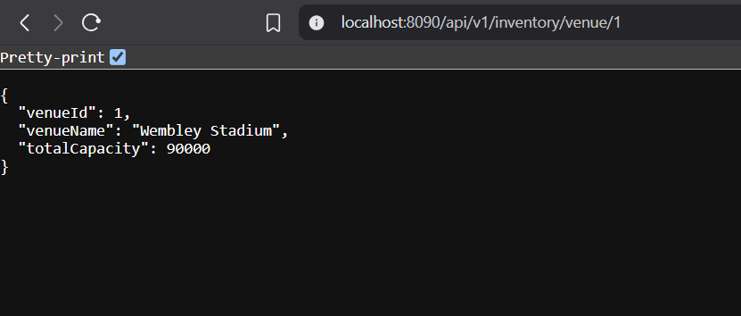
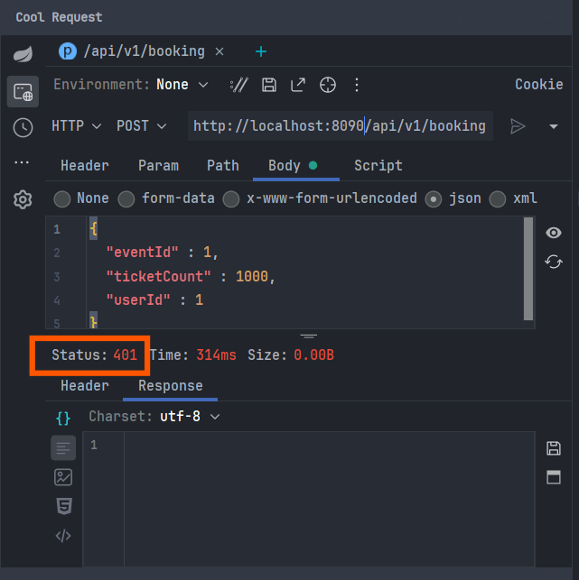
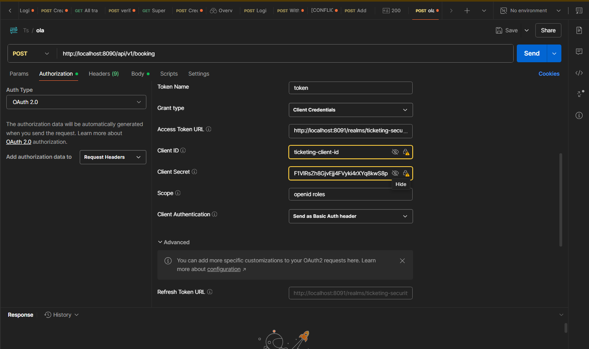
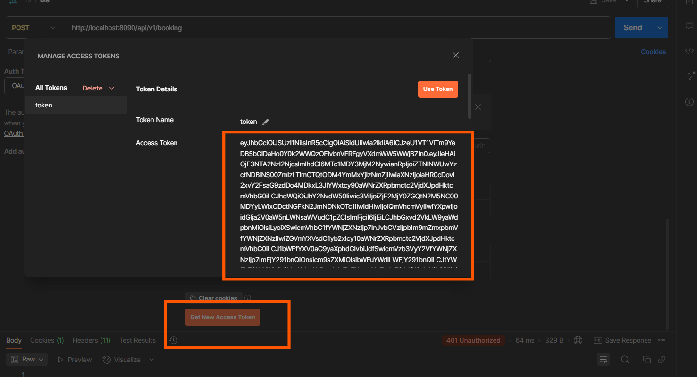
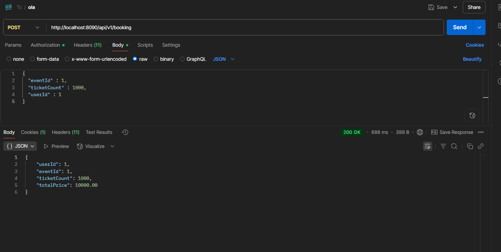

### Ensure you run the api gateway last, so that it can connect to the other services.

if you now use the api gateway port on the browser, you should see the api gateway page.

If you restart the gateway now and ping the api gateway, you will get a `401` error, because the gateway is protected by Keycloak.

Go to postman and generate a token for the user you created in Keycloak.

Click on use the token and then run the request again.
