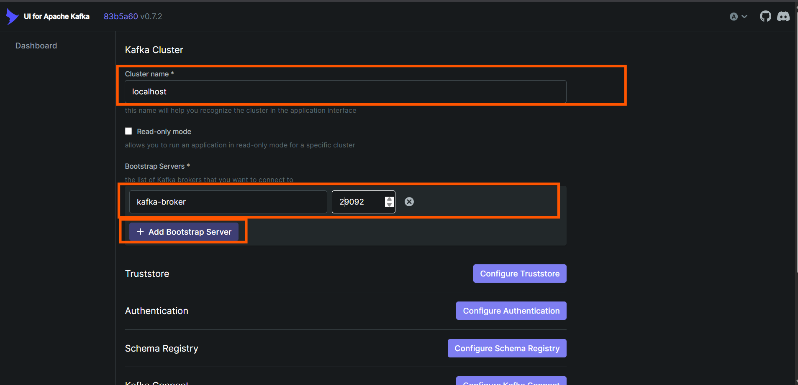
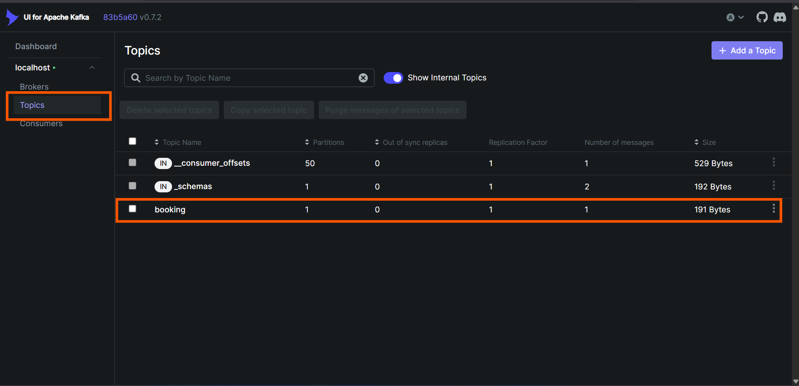

### Create customer 
```mysql

INSERT INTO `customer` (name, email, address)
VALUES ('John Doe', 'john@yopmail.com', '123 Main St, Springfield, USA');
```

### Kafka UI
http://localhost:8084



## You will see this:

See the topics created by the application:

