### docker commands
```bash
docker compose up -d # starts the container in detached mode
docker compose down -v  # stops and removes the container and volume (if needed)
docker compose up -d
docker compose -v up -d

```

### Test mySQL connection
```bash
docker exec -it mysql mysql -u root -p
```

### For flyway migrations
- Create a new migration file in the `resources/db.migration` directory with a name like `V1__initial.sql`.
- Create your SQL migration script in that file.
```mysql
CREATE TABLE venue (
    id BIGINT AUTO_INCREMENT PRIMARY KEY,
    name VARCHAR(255) NOT NULL,
    address VARCHAR(255) NOT NULL,
    total_capacity BIGINT NOT NULL
);

CREATE TABLE event (
    id BIGINT AUTO_INCREMENT PRIMARY KEY,
    name VARCHAR(255) NOT NULL,
    venue_id BIGINT NOT NULL,
    total_capacity BIGINT NOT NULL,
    left_capacity BIGINT NOT NULL,
    CONSTRAINT fk_event_venue FOREIGN KEY (venue_id) REFERENCES venue(id) ON DELETE CASCADE
);
```
### Connect to the database
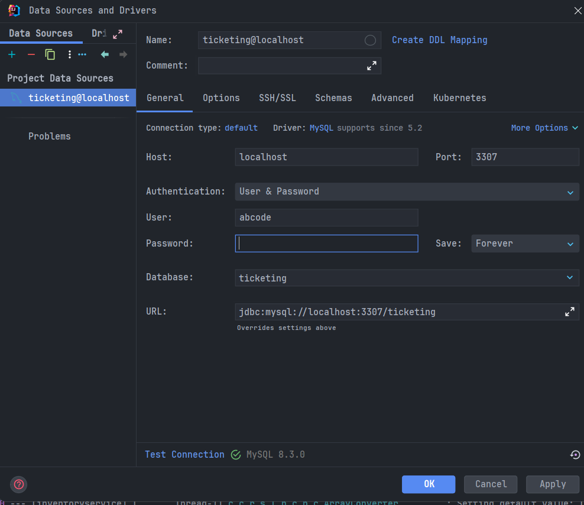
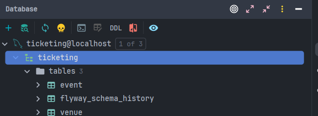

### Insert data
```mysql
-- Insert venues (stadiums)
INSERT INTO venue (name, address, total_capacity) VALUES ('Wembley Stadium', 'London, UK', 90000);
INSERT INTO venue (name, address, total_capacity) VALUES ('Old Trafford', 'Manchester, UK', 75000);
INSERT INTO venue (name, address, total_capacity) VALUES ('Camp Nou', 'Barcelona, Spain', 99354);
INSERT INTO venue (name, address, total_capacity) VALUES ('Allianz Arena', 'Munich, Germany', 75000);
INSERT INTO venue (name, address, total_capacity) VALUES ('San Siro', 'Milan, Italy', 80018);

-- Events at Wembley Stadium (venue_id = 1)
INSERT INTO event (name, venue_id, total_capacity, left_capacity) VALUES ('Concert A', 1, 50000, 50000);
INSERT INTO event (name, venue_id, total_capacity, left_capacity) VALUES ('Football Match A', 1, 70000, 70000);

-- Events at Old Trafford (venue_id = 2)
INSERT INTO event (name, venue_id, total_capacity, left_capacity) VALUES ('Concert B', 2, 40000, 40000);
INSERT INTO event (name, venue_id, total_capacity, left_capacity) VALUES ('Football Match B', 2, 65000, 65000);

-- Events at Camp Nou (venue_id = 3)
INSERT INTO event (name, venue_id, total_capacity, left_capacity) VALUES ('Concert C', 3, 60000, 60000);
INSERT INTO event (name, venue_id, total_capacity, left_capacity) VALUES ('Football Match C', 3, 80000, 80000);

-- Events at Allianz Arena (venue_id = 4)
INSERT INTO event (name, venue_id, total_capacity, left_capacity) VALUES ('Concert D', 4, 50000, 50000);
INSERT INTO event (name, venue_id, total_capacity, left_capacity) VALUES ('Football Match D', 4, 70000, 70000);

-- Events at San Siro (venue_id = 5)
INSERT INTO event (name, venue_id, total_capacity, left_capacity) VALUES ('Concert E', 5, 60000, 60000);
INSERT INTO event (name, venue_id, total_capacity, left_capacity) VALUES ('Football Match E', 5, 75000, 75000);

```


## insert customer
```mysql
INSERT INTO customer (name, email, address)
VALUES ('John Doe', 'john@yopmail', '123 Main St, Springfield, USA');
```

### Keycloak
Login to Keycloak admin console:
- username: admin
- password: admin
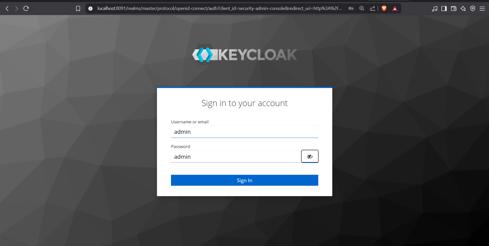

### Create a new realm
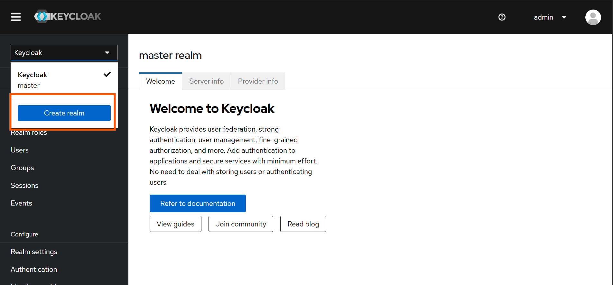

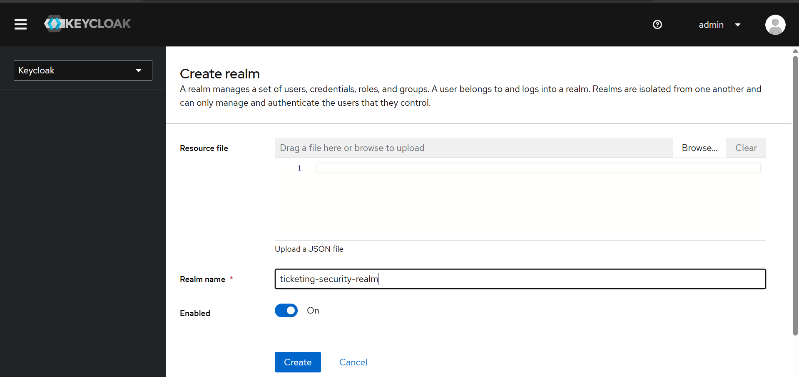


#### Create a new client
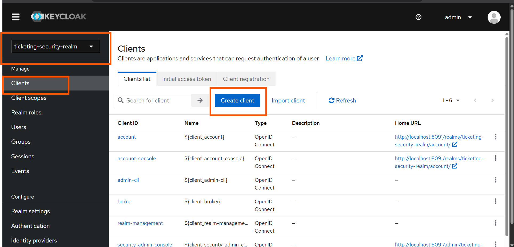

Give it a name:
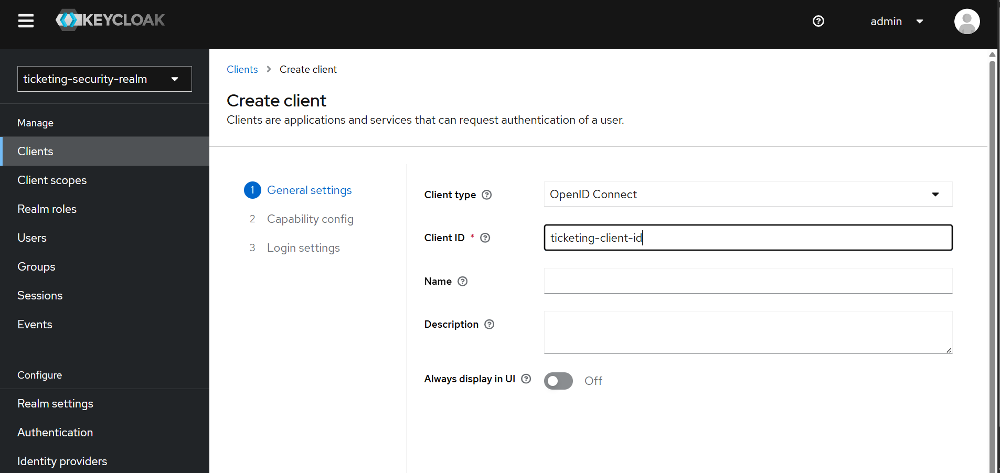
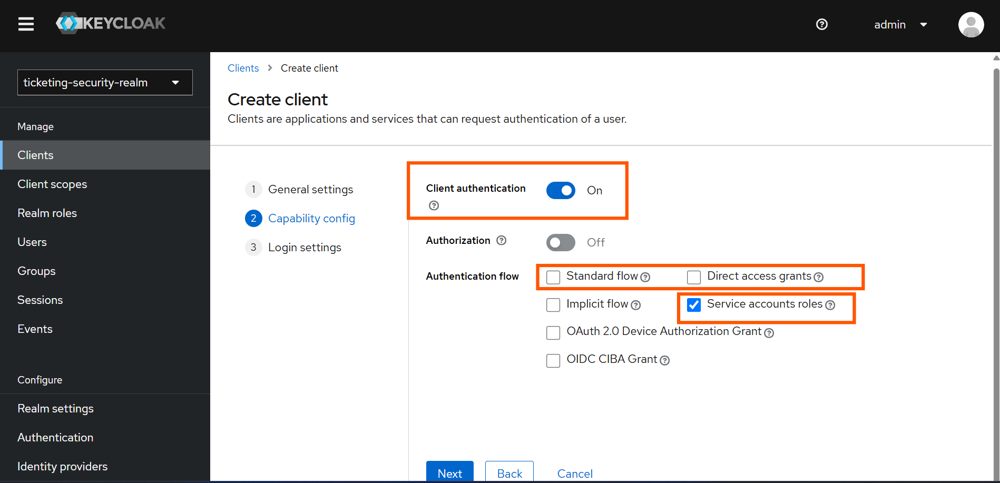
click save:
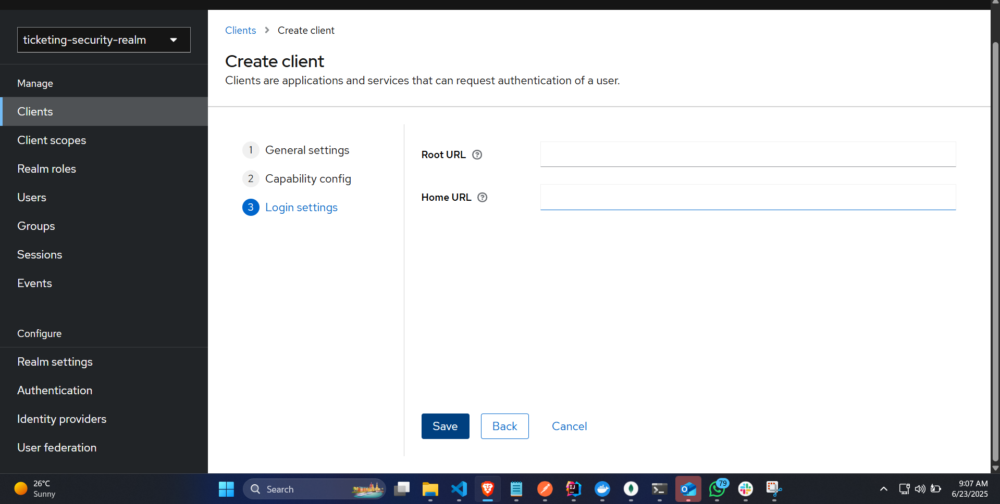

We will need the client id and secret later, so copy them now.
client-id: ticketing-client-id
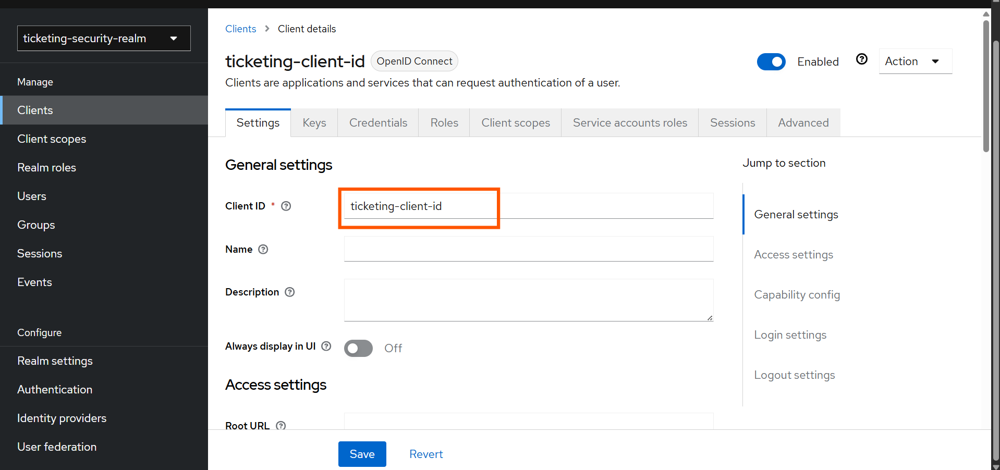
client-secret: F1VIRsZh8GjvEjj4FVyki4rXYq8kwS8p
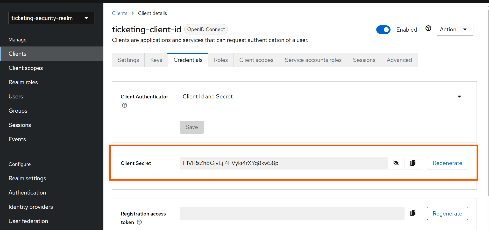

### Realm settings 
Click on the realm name in the top left corner to go to the realm settings.
Get the openid configuration URL:
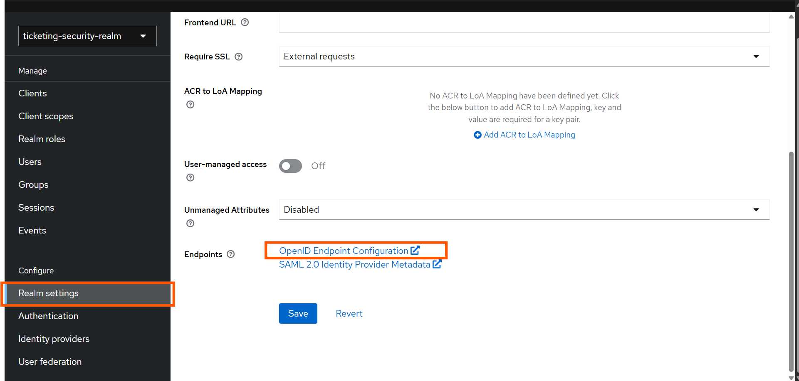

### open api
http://localhost:7070/v3/api-docs
http://localhost:7070/swagger-ui/index.html
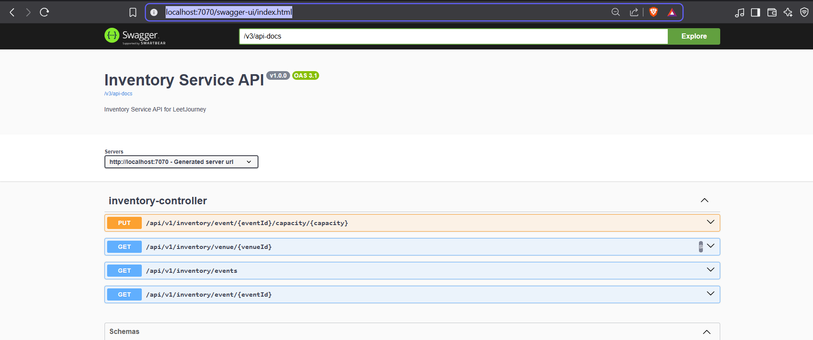
